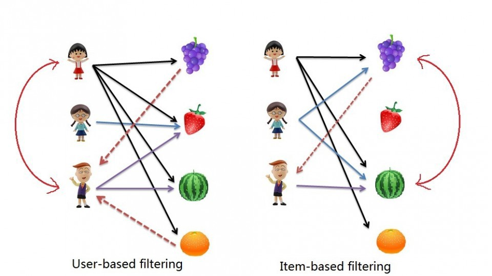

## How to design a recommendation system?

Although machine learning (ML) is commonly used in building recommendation systems, it doesn't mean it's the only solution. There are many ways to build a recommendation system? simpler approaches, for example, we may have very few data, or we may want to build a minimal solution fast etc..

Assume that, for simpler video recommendation,In such that case, based on videos a user has watched, we can simply suggest same authors videos or same publications videos.

1.  *popularity based*
2.  *classification based*
3.  *collaborative filtering*
    * Nearest neighbor
    * Matrix factorization

## 1. Popularity based:

Easiest way to build a recommendation system is popularity based, simply over all the products that are popular, So how to identify popular products, which could be identified by which are all the products that are bought most,

Example, In shopping store we can suggest popular dresses by purchase count.

## 2. Classification based

Second way to build a recommendation system is classification model, In that use feature of both users as well as products in order to predict whether this product liked or not by the user.

When new users come, our classifier will give a binary value of that product liked by this user or not, In such a way that we can recommend a product to the user .

### Classifier

In above example using user features like Age, gender and product features like cost, quality and product history, based on this input our classifier will give a binary value user may like or not , based on that boolean we could recommend product to a customer

## 3. Collaborative filtering:

collaborative filtering models which are based on assumption that people like things similar to other things they like, and things that are liked by other people with similar taste.

collaborative filtering models are two types,
* Nearest neighbor
* Matrix factorization

### Nearest neighbor collaborative filtering:

In these type of recommendation systems are recommending based on nearest neighbors, nearest neighbor approach used to find out either similar users or similar products,

It can be looked at two ways,
- User based filtering
- Item based filtering

Above image source from https://medium.com/@cfpinela/recommender-systems-user-based-and-item-based-collaborative-filtering-5d5f375a127f
*User-based collaborative filtering:*

Find the users who have similar taste of products as the current user , similarity is based on purchasing behavior of the user, so based on the neighbor purchasing behavior we can recommend items to the current user.

*Item-based collaborative filtering :*

Recommend Items that are similar to the item user bought,similarity is based on co-occurrences of purchases

Item A and B were purchased by both users X and Y then both are similar.

### Matrix factorization:

It is basically model based collaborative filtering and matrix factorization is the important technique in recommendation system.

let me give an abstractive explanation for matrix factorization,

When a user gives feed back to a certain movie they saw (say they can rate from one to five), this collection of feedback can be represented in a form of a matrix. Where each row represents each users, while each column represents different movies. Obviously the matrix will be sparse since not everyone is going to watch every movies, (we all have different taste when it comes to movies).

Image source from <https://www.youtube.com/watch?v=ZspR5PZemcs>

further more information on matrix factorization kindly refer <http://www.quuxlabs.com/blog/2010/09/matrix-factorization-a-simple-tutorial-and-implementation-in-python/>

Hybrid Recommendation systems:

Hybrid Recommendation systems are combining collaborative and content-based recommendation can be more effective. Hybrid approaches can be implemented by making content-based and collaborative-based predictions separately and then combining them.

source code : <https://www.kaggle.com/rounakbanik/movie-recommender-systems>